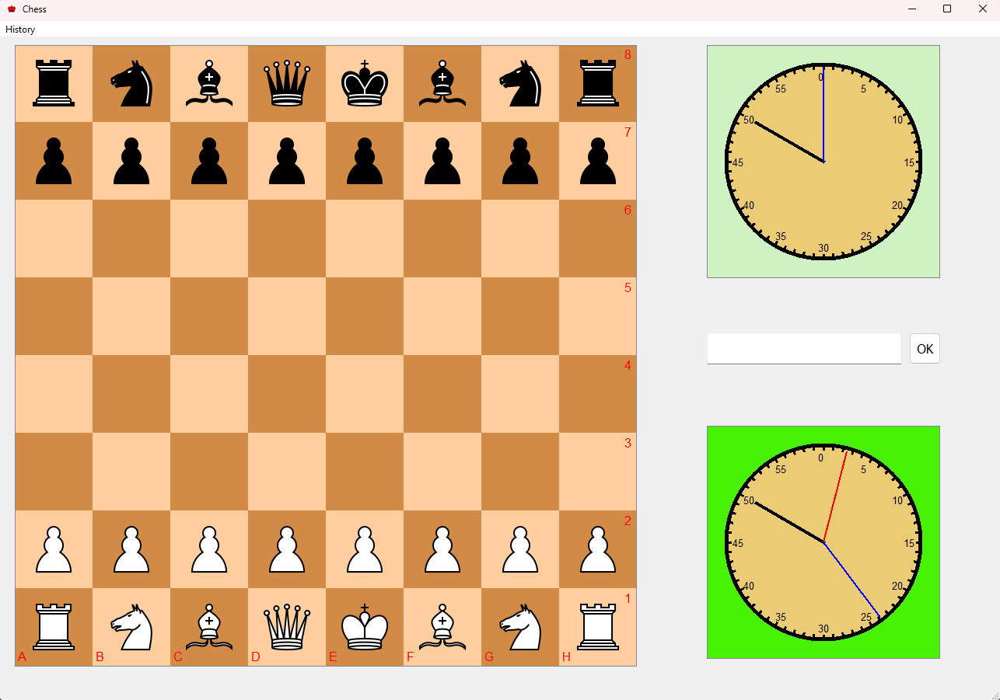
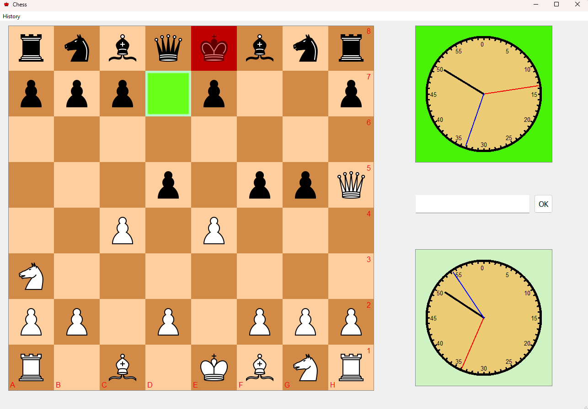
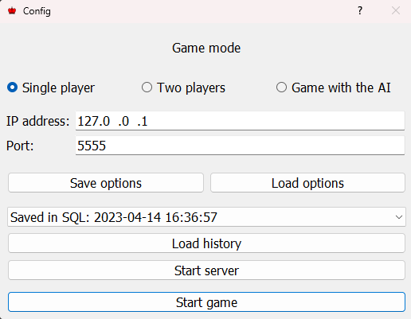
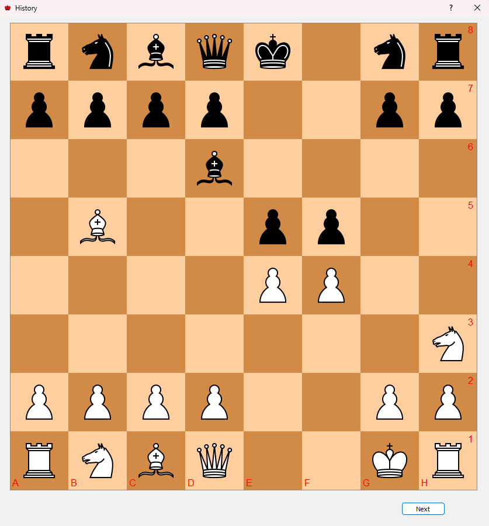

# Chess game ♔
Chess app with all the rules (including castling, en passant, pawn promotion) 
and animated clocks. There are options to save history to database or xml
file. Currently working on artificial intelligence and online mode.

## Board 
There is the board with all pieces and clock for each player.

## Rules
When user press the piece, all legal moves are highlighted in green. 
Checked king is highlighted in red.

## Config
In the configuration window, the user can select the type of game, enter the IP address and port.
All options can be saved to a json file.

## History

User can also save game history to SQLite3 database or XML file. There is an option
to playback all saved games.

## Future assumptions

- Create online mode
- Create bot

